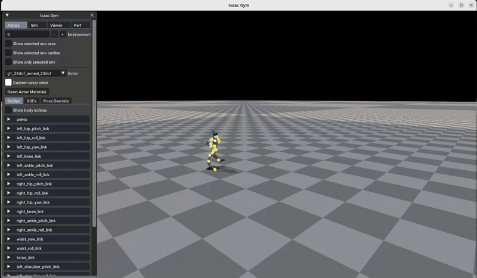

# G1 Single-Leg Jump Project

A custom single-leg jumping robot project based on [ASAP](https://github.com/LeCAR-Lab/ASAP), developed for imitation learning of single-leg jump motions using IsaacGym. This project showcases how to extend the ASAP codebase for specialised tasks.

<p align="center">

</p>

## 🛠️ Installation and Setup

### 1. Create Conda Environment

```bash
conda create -n hvgym python=3.8
conda activate hvgym
```

### 2. Install IsaacGym

Download [IsaacGym](https://developer.nvidia.com/isaac-gym/download) and extract:

```bash
wget https://developer.nvidia.com/isaac-gym-preview-4
# extract to your desired path
tar -xvzf isaac-gym-preview-4
```

Install the Python API:

```bash
pip install -e isaacgym/python
```

Test installation:

```bash
python 1080_balls_of_solitude.py
```

### 3. Setup Environment Variables
Note: The following LD_LIBRARY_PATH setting is required for some environments (adjust the path to your actual conda environment):
```bash
export LD_LIBRARY_PATH=/home/caesar/anaconda3/envs/hvgym/lib:$LD_LIBRARY_PATH
```
- Set LD_LIBRARY_PATH:
    ```bash
    export LD_LIBRARY_PATH=</path/to/conda/envs/your_env/lib>:$LD_LIBRARY_PATH
    ```
### 4. Install Project Dependencies

```bash
pip install -e .
pip install -e isaac_utils
```

## 🚀 How to Train and Evaluate

### ✅ Continue Training from Checkpoint

```bash
python humanoidverse/train_agent.py \
  +simulator=isaacgym \
  +exp=motion_tracking \
  +domain_rand=NO_domain_rand \
  +rewards=motion_tracking/reward_motion_tracking_dm_2real \
  +robot=g1/g1_29dof_anneal_23dof \
  +terrain=terrain_locomotion_plane \
  +obs=motion_tracking/deepmimic_a2c_nolinvel_LARGEnoise_history \
  +checkpoint="logs/G1_jumps/20250426_222426-jumps1_subject5-motion_tracking-g1_29dof_anneal_23dof/model_25700.pt" \
  project_name=G1_jumps \
  experiment_name=jumps1_subject5 \
  num_envs=2 \
  headless=False \
  robot.motion.motion_file="humanoidverse/data/motions/g1_29dof/SingerLegJumps/jumps1_subject5.pkl" \
  rewards.reward_penalty_curriculum=True \
  rewards.reward_penalty_degree=0.00001 \
  env.config.resample_motion_when_training=False \
  env.config.termination.terminate_when_motion_far=True \
  env.config.termination_curriculum.terminate_when_motion_far_curriculum=True \
  env.config.termination_curriculum.terminate_when_motion_far_threshold_min=0.3 \
  env.config.termination_curriculum.terminate_when_motion_far_curriculum_degree=0.000025 \
  robot.asset.self_collisions=0
```

### ✅ Evaluate a Trained Model

```bash
python humanoidverse/eval_agent.py \
+checkpoint=logs/G1_jumps/20250426_222426-jumps1_subject5-motion_tracking-g1_29dof_anneal_23dof/model_25700.pt
```

## 🎥 Example Result

<p align="center">

</p>

## 📖 Citation

If you use this project, please cite the original ASAP paper:

```bibtex
@article{he2025asap,
  title={ASAP: Aligning Simulation and Real-World Physics for Learning Agile Humanoid Whole-Body Skills},
  author={He, Tairan and Gao, Jiawei and Xiao, Wenli and Zhang, Yuanhang and Wang, Zi and Wang, Jiashun and Luo, Zhengyi and He, Guanqi and Sobanbabu, Nikhil and Pan, Chaoyi and Yi, Zeji and Qu, Guannan and Kitani, Kris and Hodgins, Jessica and Fan, Linxi "Jim" and Zhu, Yuke and Liu, Changliu and Shi, Guanya},
  journal={arXiv preprint arXiv:2502.01143},
  year={2025}
}
```

## 📄 License

This project is licensed under the MIT License - see the [LICENSE](LICENSE) file for details.
